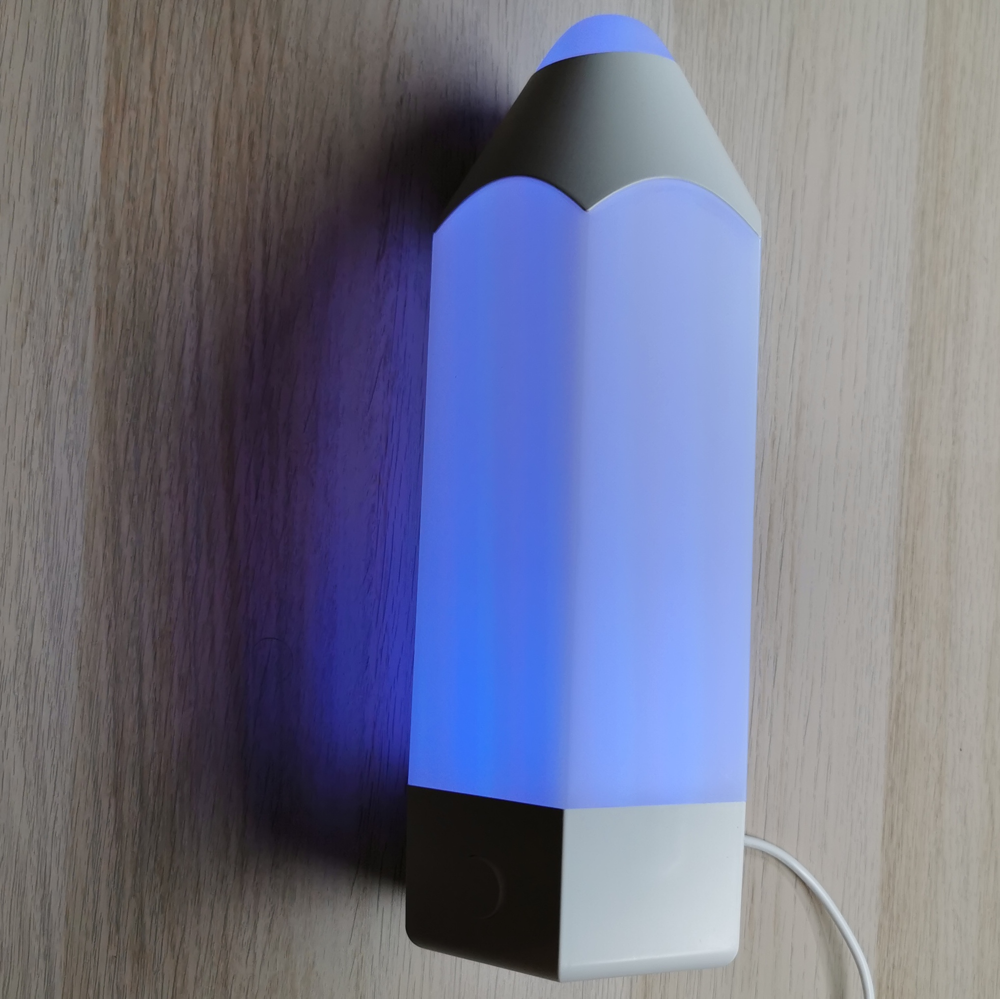
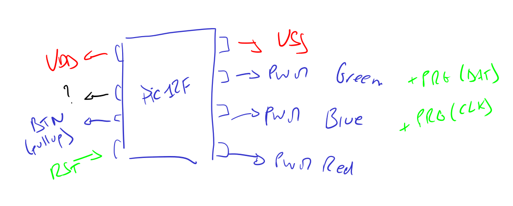

# 🖍️ ESPcrayon

Transform your IKEA PELARBOJ lamp into a smart, WiFi-enabled RGB light with
customizable effects.

<p align="center">
   
</p>

## ✨ What is ESPcrayon?

ESPcrayon is a hardware hack for the **IKEA PELARBOJ** lamp (a pencil-shaped LED
lamp, or "crayon" in French). This project replaces the original PIC12F
controller with an **ESP32-C3 Super Mini** board, adding WiFi connectivity and
smart home integration through ESPHome.

## 🚀 Getting Started

### Hardware Requirements

- IKEA PELARBOJ lamp
- ESP32-C3 Super Mini board (or compatible ESP32-C3 board)
- Buck converter (24V to 5V)

### Software Requirements

- [ESPHome](https://esphome.io/) installed

### 📦 Installation

1. **Clone this repository**

   ```bash
   git clone https://github.com/TehoorMarjan/espcrayon.git
   cd espcrayon
   ```

2. **Configure your secrets**

   Copy the secrets template and fill in your details:

   ```bash
   cd src
   cp secrets.tpl.yaml secrets.yaml
   ```

3. **Flash the firmware**

   ```bash
   cd src
   esphome run crayon.yaml
   ```

   For the first flash, connect the ESP32-C3 via USB. Depending on the board,
   you may need to activate the BOOT interface. On the ESP32-C3 Super Mini
   board, this is done by pressing shortly the RESET button all while holding
   the BOOT button.

## 🛠️ Tooling

[](https://mybinder.org/v2/gh/TehoorMarjan/espcrayon/HEAD?urlpath=%2Fdoc%2Ftree%2Ftools%2Frainbow_maker%2Frainbow.ipynb)

I've included a small Jupyter Notebook to help generate a custom rainbow color
effect.

You'll need `jinja2` and `ipywidgets` installed to run it. Or use the Binder
link above.

Simply copy the generated YAML code into your `crayon.yaml` configuration in
place of the existing rainbow effect, or following.

## 📚 Documentation

- [ESPHome Getting Started Guide](https://esphome.io/guides/getting_started_command_line/)
- [ESP32-C3 Super Mini Pinout Reference](https://randomnerdtutorials.com/getting-started-esp32-c3-super-mini/#pinout)




## 📄 License

This project is licensed under the MIT License. See the [LICENSE](LICENSE).
