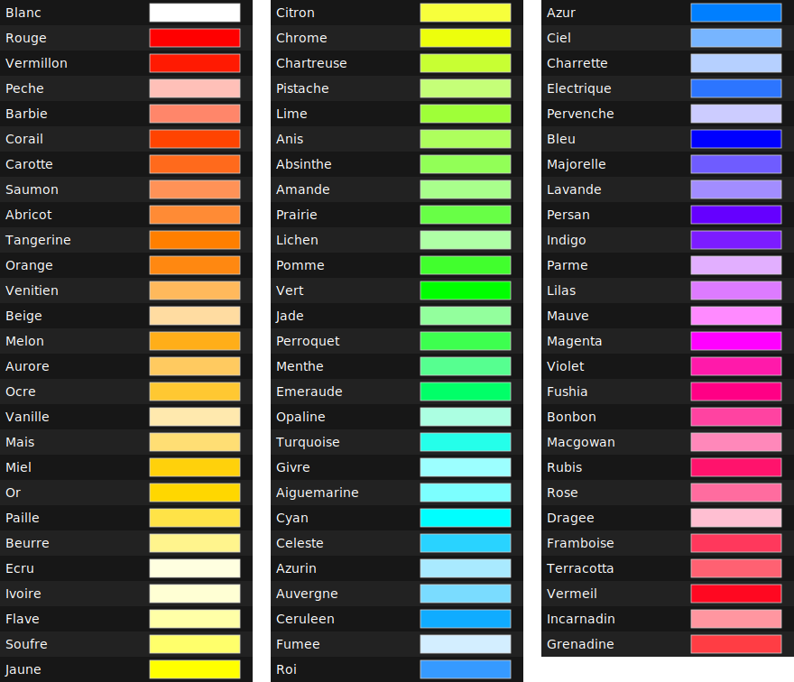

# Utiliser le Bot

Le bot Twitch propose plusieurs commandes amusantes pour interagir.

## Le Crayon Lumineux

Vous pouvez piloter le crayon lumineux en utilisant la commande `!crayon` suivie
d'une couleur ou d'un effet. Plusieurs formats sont acceptés :

- Les valeurs rouge vert bleu séparées par des virgules :

  ```plaintext
  !crayon 255,0,0
  ```

- Le code hexadécimal CSS, à 3 ou 6 chiffres :

  ```plaintext
  !crayon #ff0000
  !crayon #f00
  ```

- Un nom de couleur prédéfinie (sans accents) :

  ```plaintext
  !crayon Rouge
  ```

- Un effet spécial :

  ```plaintext
  !crayon Rainbow
  ```

### Liste des Effets

| Nom     | Description                                                                                    |
| ------- | ---------------------------------------------------------------------------------------------- |
| Flicker | Simule une flamme vacillante, la couleur est identique à celle actuelle (peu visible en ligne) |
| Rainbow | Traverse doucement toutes les couleurs                                                         |
| Nodus   | Effet clin d'œil qui reprend les couleurs de la chaîne @no_dus                                 |

### Liste des Couleurs Prédéfinies


